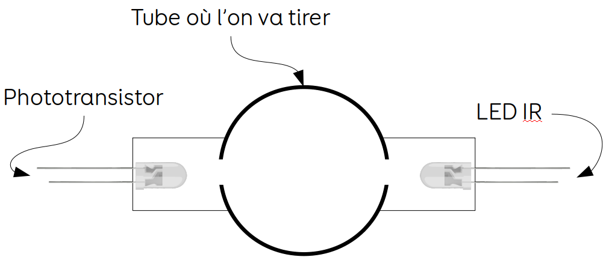

# Chrony Airsoft
Voici un Chrony pas chère à faire, fait maison et Open Source.
Dans ce Git vous trouverez un tuto complet pour créer une réplique de chrony avec un Arduino.
Pour précision un enfant de 12 ans pourrait faire ce chrony il n'est vraiment pas complexe à fabriquer. 

## Pourquoi ce projet ?
Je devais tester une réplique d'un ami pour voir si elle n'était pas trop puissante pour nos parties mais étant encore en Terminale je n'avais pas envie d'acheter un Chrony pro à 80€ pour m'en servir 3 fois par an.
J'ai donc décidé de chercher sur le web si quelqu'un avait déjà tenté d'en fabriquer un, j'ai trouvé un tuto sur france-airsoft.fr, le problème était qu'il fallait obligatoirement un PC avec une carte son avec soi pour le faire fonctionner (le lien du tuto en bas).
Passionné par l'univers Arduino j'ai essayé de reproduire le mécanisme du tuto mais avec un Arduino pour qu'il soit autonome, transportable partout et léger :joy:.

## Qu'est-ce qu'il fait et de quoi à ton besoin 
Ce chrony permet de mesurer trois valeurs :

 - Le nombre de FPS 
 - Les Joules
 - La vitesse de la bille en m/s

Pour le réaliser on a besoin :

- [ ] Un fer à souder, des fils, et quelques outils. 
- [ ] un Arduino nano (pas besoin d'un Mega pour ça) - Amazon : [ici](https://www.amazon.fr/dp/B0722YYBSS?ref=yo_pop_ma_swf).
- [ ] deux LEDs IR (Infrarouge) et deux phototransistors - Amazon [ici](https://www.amazon.fr/dp/B07912J5V2?ref=yo_pop_ma_swf).
- [ ] deux résistances de 100 ohms (:bangbang:  la valeur des résistances peut varier en fonction des LEDs que vous utilisez, si vous prenez les mêmes que moi il n'y aura pas de souci - Amazon [ici](https://www.amazon.fr/dp/B00PZYO11K/ref=cm_sw_em_r_mt_dp_U_kY5fCbMJ4STSB). 
- [ ] un bouton ON/OFF ou un Switch pour allumer et éteindre - Amazon [ici](https://www.amazon.fr/dp/B07CXL7111/ref=cm_sw_em_r_mt_dp_U_v05fCbKMZR0ZB).
- [ ] une imprimante 3D ou de quelques morceaux de bois, de tubes en PVC, etc pour la boîte.
- [ ] un téléphone portable pour recevoir les valeurs.

## Comment ça marche

On a un tube où l'on va tirer avec sa réplique.
Sur ce tube on va venir mettre une LED IR et un phototransistor face à face comme sur l'image :
 
Cette paire on va en mettre 2 fois sur le tube, une à l'avant et une à l'arrière.

Le phototransistor réagit quand il reçoit un rayon infrarouge, dès qu'il va recevoir le rayon il va envoyer une impulsion à l'Arduino on va donc se servir de ça pour notre chrony (d'après ce que j'ai vu sur le web, les chronys pros utilisent le même fonctionnement).

### Explication du code

Quand l'Arduino va démarrer il va "attendre" il va falloir appuyer sur le bouton ON/OFF pour allumer les LEDs, dès l'allumage les phototransistors vont envoyer une impulsion constante à l'Arduino, jusqu'ici rien ne se passe, je n'ai toujours pas tiré.

Dès que je vais tirer ma première bille, elle va couper le premier rayon, à ce moment le phototransistor ne va plus envoyer son impulsion, l'Arduino va détecter ce changement et il va assigner à une variable (temps_capteur_1) la valeur de la fonction ~~millis()~~ micros() (cette fonction retourne le nombre de ~~millisecondes~~ microsecondes qui s'est écoulé depuis que l'Arduino à démarré) j'ai changé la fonction millis() par micros() car si on a une réplique qui tire une bille à 75 m/s cela signifie qu'elle parcoure 7,5 cm en 1 milliseconde donc il faudrait un espace entre les deux capteurs d'au moins 7,5 cm, jusqu'ici on pourrait éventuellement le faire mais si notre bille va à 150 m/s il faudrait donc 15 cm entre les capteurs (ce qui ne nous intéresse pas).
Par la suite ma bille continue son trajet et viens couper le deuxième rayon, même principe que pour le premier, l'Arduino va assigner à une variable (temps_capteur_2) la valeur de ~~millis()~~ micros(), par la suite l'Arduino va calculer automatiquement toutes les valeurs, il les affiche ensuite sur la sortie série (pour l'instant).

A savoir : dans 1 seconde il y a 1 000 millisecondes et dans 1 seconde il y a 1 000 000 de microsecondes (remplacer la fonction millis() par micro() nous apporte davantage de précision). 

:bangbang: ATTENTION :bangbang: : dans mon code il faudra changer certaines valeurs comme le poids de la bille ou la distance entre les deux capteurs.

## Le Tuto
### Le montage mécanique
Pour commencer, il faut créer votre boîte.

Image à mettre en 3D

La boîte à peu d'importance donc vous pouvez la faire comme vous voulez, par contre le tube dans lequel on va tirer doit être hyper précis c'est pour ça que j'utilise une imprimante 3D pour la faire.

Cette image a été faite à l'arrache mais bon le tube vert est celui où l'on va tirer, et les deux autres noirs ce sont les deux LEDs IR et de l'autre côté du tube on a aussi deux tubes noirs où sont les phototransistors.

:bangbang: ATTENTION :bangbang: : la distance entre les deux LEDs doit être très précise et prenez un entier (plus simple pour les calculs) genre 1 cm ou 2 cm ou même 10 cm comme dans le tuto de france-airsoft.fr, de même la distance entre les deux phototransistors doit être la même que celle des LEDs.
:bangbang: ATTENTION :bangbang: : cette distance doit être renseignée dans le code à la ligne 8 à la variable *distance_capteur*.

### Le montage électronique

Voici le montage électrique que je propose, un schéma très basique on relie le bouton ON/OFF  (je n'avais que ce bouton pour faire mon exemple), une patte au GND (masse) et au pin 2 de l'arduino.
On relie la plus grande patte du capteur n°1 au GND et la petite au pin 3, pour le capteur n°2 la grande patte au GND et l'autre au pin 4.

Pour la première LED IR c'est un peu différent, le constructeur indique que la tension de seuil de la LED et de 1,2V à 1,4V sauf que notre Arduino envoie du 5V donc il faut utiliser une résistance pour diminuer la tension aux bornes de la LED.

Pour calculer la valeurs de la résistance on doit calculer la tension à ses bornes (or courant) avec ce calcul :

> UR = 5V - ULED = 5V - 1.3V = 3.7V
UR est la tension aux bornes de la résistance (ce que l'on cherche)
5V car l'Arduino donne du 5V
ULED est la tension de seuil (donnée par le constructeur)

Donc UR = 3.7V, or le courant de la résistance est égal à celui de la LED, c'est à dire 100mA sauf que notre Arduino envoie que du 40mA donc on prends 40mA pour la valeur du courant.
La valeur de la résistance se déduit à partir des deux informations grâce à la loi d'ohms:

> U=R*I <=> R=U/I
> R=3.7/0.04A = 92,5 Ω

Notre résistance devra faire 92,5 Ω sauf que ce n'est pas une valeur standard on va donc prendre des résistances de 100 Ω.

On relie une patte de la résistance au pin 5 et l'autre patte à la grande patte de la LED IR n°1 et la petite patte au GND, pareil pour la deuxième LED IR, une patte de la résistance au pin 6 l'autre à la grande patte de la LED et la petite patte au GND

### La programmation
Pour la programmation vous devez téléverser le code dans l'Arduino, par contre pensez bien à modifier vos variables comme le poids de la bille ou la distance entre les deux capteurs :bangbang:  cette valeur est en mètre :bangbang: .

## Annexes

http://www.france-airsoft.fr/forum/index.php?showtopic=111787

https://www.astuces-pratiques.fr/electronique/led-et-calcul-de-la-resistance-serie
